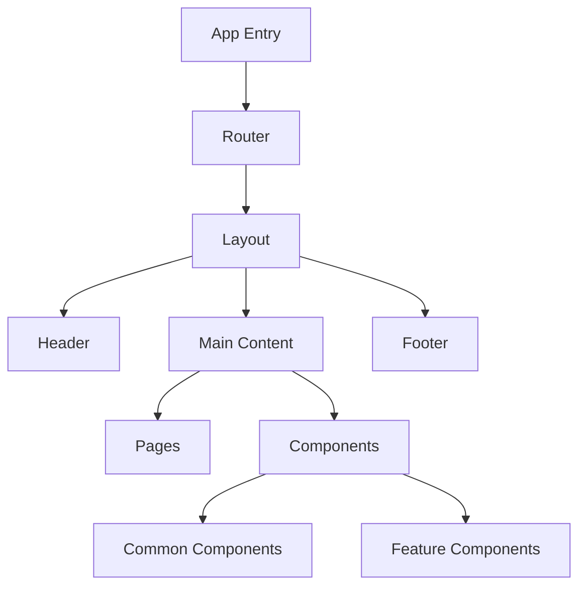
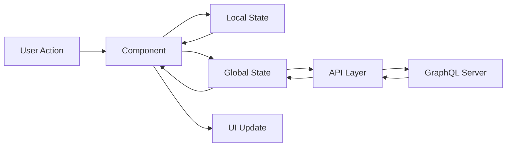
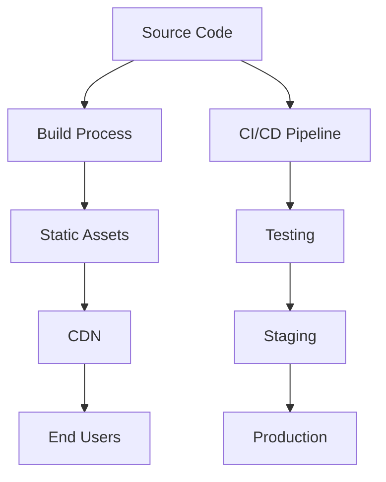

# Technical Architecture

## System Architecture

### Frontend Architecture



### State Management

1. **Global State**
   - AuthContext: User authentication state
   - CommerceContext: Shopping cart and checkout state
   - Apollo Client: Remote data state

2. **Local State**
   - Component-level useState
   - Form state with Formik
   - Custom hooks for specific features

### Data Flow



## Component Architecture

### Core Components

1. **Layout Components**
   - Layout.tsx: Main layout wrapper
   - Header.tsx: Navigation and user controls
   - Footer.tsx: Site footer and links

2. **Product Components**
   - ProductCard.tsx: Individual product display
   - ProductGrid.tsx: Product list container
   - ProductFilters.tsx: Filter and sort controls
   - ProductInfo.tsx: Detailed product information

3. **Cart Components**
   - CartItem.tsx: Individual cart item
   - CartSummary.tsx: Cart totals and checkout
   - MiniCart.tsx: Cart preview

4. **Checkout Components**
   - CheckoutSummary.tsx: Order summary
   - ShippingForm.tsx: Shipping information
   - PaymentForm.tsx: Payment processing

### Directory Structure

```
src/
├── components/
│   ├── auth/
│   ├── cart/
│   ├── checkout/
│   ├── common/
│   ├── home/
│   ├── layout/
│   ├── products/
│   └── search/
├── hooks/
├── pages/
├── services/
├── store/
├── styles/
├── types/
└── utils/
```

## API Integration

### GraphQL Schema Structure

```graphql
type Product {
  id: ID!
  sku: String!
  name: String!
  url_key: String!
  price: Price!
  image: Image
  eco_friendly_features: [String]
  stock_status: StockStatus!
}

type Order {
  id: ID!
  items: [OrderItem!]!
  total: Money!
  status: OrderStatus!
  shipping_address: Address!
  billing_address: Address!
}

type Cart {
  id: ID!
  items: [CartItem!]!
  totals: CartTotals!
}
```

### API Endpoints

1. **Products**
   - Query: getProducts
   - Query: getProductByUrlKey
   - Query: getFeaturedProducts

2. **Cart**
   - Mutation: addToCart
   - Mutation: updateCartItem
   - Mutation: removeFromCart

3. **Checkout**
   - Mutation: createCheckout
   - Mutation: processPayment
   - Mutation: placeOrder

## Performance Optimization

### Current Optimizations

1. **Code Splitting**
   - Route-based splitting
   - Component lazy loading
   - Dynamic imports

2. **Image Optimization**
   - Responsive images
   - Lazy loading
   - WebP format support

3. **Caching Strategy**
   - Apollo Cache
   - Browser cache
   - Local storage

### Security Measures

1. **Authentication**
   - JWT-based auth
   - Protected routes
   - Session management

2. **Data Protection**
   - HTTPS
   - Input validation
   - XSS prevention

## Testing Strategy

### Test Types

1. **Unit Tests**
   - Component tests
   - Hook tests
   - Utility tests

2. **Integration Tests**
   - Feature tests
   - API integration tests

3. **E2E Tests**
   - User flow tests
   - Critical path tests

## Deployment Architecture



## Monitoring and Analytics

1. **Performance Monitoring**
   - Core Web Vitals
   - Error tracking
   - User behavior

2. **Business Analytics**
   - Conversion tracking
   - User engagement
   - Sales metrics
